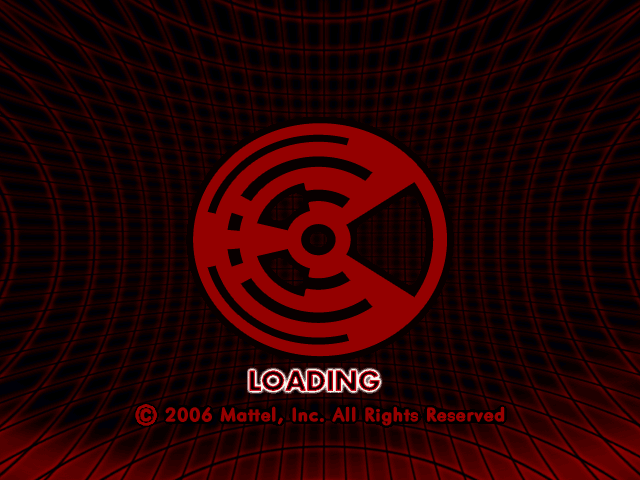
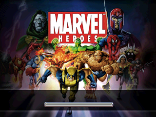
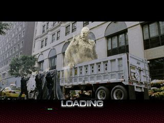
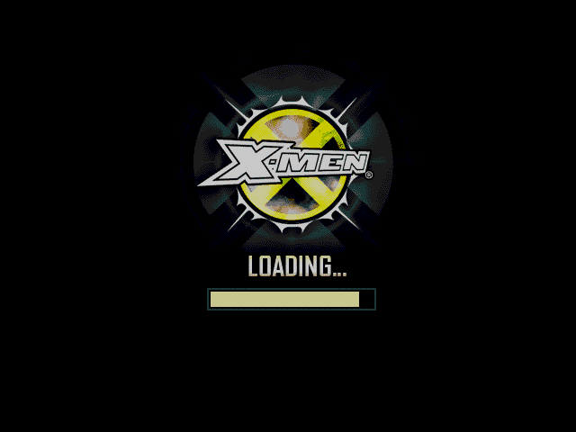

# Game Compatibility

HyperScan titles ship on CD (`MODE1/2352` BIN / single-track CUE / ZIP) and may
use 120-byte RFID save cards. Firmware and media are never distributed with the
emulator; results below are from legally dumped local images only.

Each package was tested by running `scripts/batch-screenshots.ps1` (headless
`--screenshot`) for **1800 frames** and classifying the captured PNG. This
matrix records **boot progress**, not full gameplay certification. Title, menu,
input, and gameplay behavior are not yet claimed.

Capture reference (approximate):

| Frames | Milestone |
|---:|---|
| 300 | HyperScan startup frame |
| 900 | CD identify / TOC |
| 1600 | Retail loading screen |
| 3600 | Opening animation |

## Status scale

| Status | Meaning |
|---|---|
| ✅ Pass | Game-specific loading screen (or better) rendered without a structured stop |
| ⚠️ Partial | Boots past BIOS / system loading but no game-specific progress yet |
| ❌ Fail | Unknown instruction/MMIO stop, crash, or no visible progress |
| — | Not yet tested under a recorded headless run |

## Summary

| Status | Count |
|---|---:|
| ✅ Pass (game loading screen) | 6 |
| ⚠️ Partial (system loading / blank after load) | 2 |
| ❌ Fail | 0 |
| **Total** | **8** |

| Area | Status | Notes |
|---|---|---|
| BIOS boot path | ✅ | All eight packages completed `--inspect` and headless boot |
| CD identify / TOC | ✅ | Deterministic analog feedback completes focus and tracking |
| Retail loading screens | ✅ | Ben 10, Marvel Heroes, Spider-Man, X-Men (USE revisions) |
| Opening animation | — | Not captured in this batch |
| Title / menu | — | Not yet recorded per title |
| Gameplay | — | Not yet claimed |
| Audio (DAC PCM) | ⚠️ | Transport works; hardware synthesizer is silent |
| Save cards | ⚠️ | Protocol modeled; persistence is frontend work |

## Game List

Screenshots are the 1800-frame `--screenshot` output (`docs/images/`).
`USE` / `USE2` are distinct local revisions of the same title.

| # | Game | 中文名称 | File | Screenshot | Status |
|---|------|----------|------|------------|--------|
| 1 | Ben 10 | 少年骇客 | tmp/hyperscan_game/Ben 10 (USA) (USE1).zip |  | ✅ Pass |
| 2 | Ben 10 | 少年骇客 | tmp/hyperscan_game/Ben 10 (USA) (USE2).zip |  | ✅ Pass |
| 3 | Interstellar Wrestling League | 星际摔角联盟 | tmp/hyperscan_game/IWL - Interstellar Wrestling League (USA) (USE1).zip |  | ⚠️ Partial |
| 4 | Interstellar Wrestling League | 星际摔角联盟 | tmp/hyperscan_game/IWL - Interstellar Wrestling League (USA) (USE2).zip |  | ⚠️ Partial |
| 5 | Marvel Heroes | 漫威英雄 | tmp/hyperscan_game/Marvel Heroes (USA) (USE2).zip |  | ✅ Pass |
| 6 | Spider-Man | 蜘蛛侠 | tmp/hyperscan_game/Spider-Man (USA).zip |  | ✅ Pass |
| 7 | X-Men | X战警 | tmp/hyperscan_game/X-Men (USA) (USE).zip |  | ✅ Pass |
| 8 | X-Men | X战警 | tmp/hyperscan_game/X-Men (USA) (USE2).zip |  | ✅ Pass |

### Notes on this batch

- **Ben 10** — 640×240 game loading screen (logo + progress bar).
- **Spider-Man** — 320×240 game loading screen (city art + LOADING).
- **X-Men** — 640×480 game loading screen (logo + LOADING...).
- **Marvel Heroes** — game loading screen (character art + progress bar) after
  retiming to 3600 frames (`scripts/batch-screenshots.ps1` override).
- **IWL** — HyperScan system loading at 1800 frames; 3600 and 5000 frames are
  blank (2 KB PNG). Keep Partial until a non-black game frame is observed.

## Reporting results

1. Run `--inspect` on the package and keep the output.
2. Capture boot progress with headless `--frames`/`--output` (optional PPM) or
   `--screenshot`.
   For a full local corpus of ZIP packages under `tmp/hyperscan_game`, use
   `scripts/batch-screenshots.ps1` to write PNGs into `docs/images/`.
3. Record the milestone reached, geometry, and any structured stop reason.
4. Open an issue or PR that updates this table — never commit firmware, BIN/CUE/ZIP
   game data, or card dumps.

Example reference commands:

```text
hyperscanemu -r <internal-rom.bin> -b <bios.bin> --trace 15000000
hyperscanemu <media> -r <internal-rom.bin> -b <bios.bin> --headless --frames 300 --output frame.ppm
```

Headless runs print UART, final PC, PPU/TVE controls, layer state, CD command
origins and servo position. Treat the optional PPM as the visual oracle;
framebuffer fingerprints alone do not establish rendering correctness.

Do not mark gameplay ✅ without a recorded interactive session. See
[Game File Formats](Game-File-Formats.md) for accepted media shapes.
